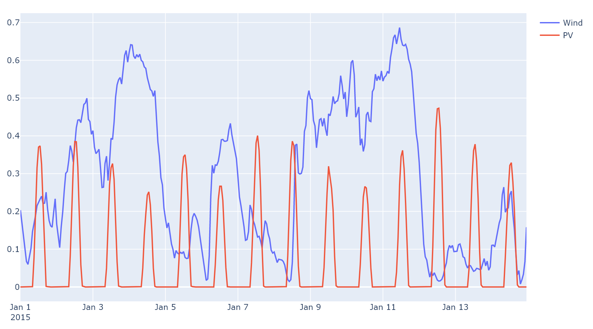

.. _datasets:

Dataset
-----------------------

.. automodule:: reperiods.datasets
   :members:
   :undoc-members:
   :show-inheritance:

Example
^^^^^^^

.. code-block:: python

    import reperiods as ps
    from reperiods.datasets import load_renewable

    # Loading a dataset of hourly capacity factor in a TemporalData object
    data = load_renewable(24*7*2)
    temporal_data = ps.TemporalData(data)
    temporal_data.plot_curves()

