.. title:: Example

.. _exemple:

==========
Example
==========

.. code-block:: python

    import reperiods as rp
    from reperiods.datasets import load_renewable

    # Loading a dataset of hourly capacity factor in a TemporalData object
    data = load_renewable(24*7*2)
    temporal_data = rp.TemporalData(data)
    temporal_data.plot_curves()

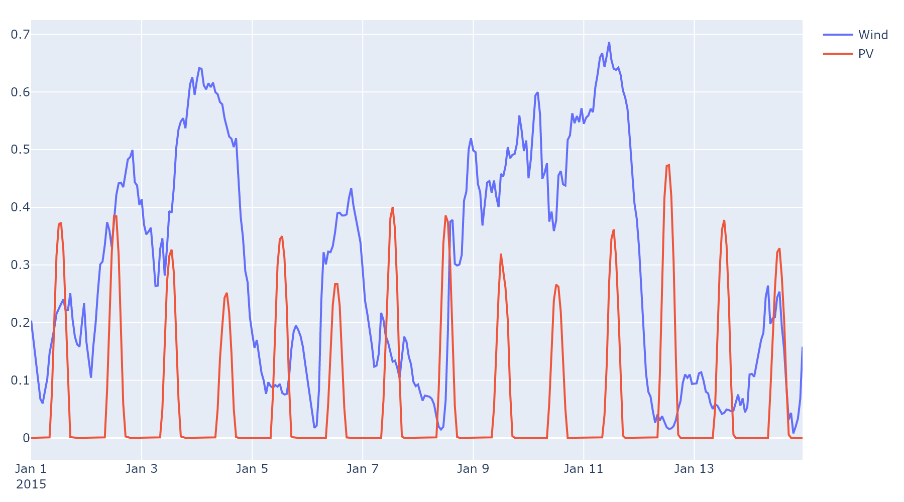

Finding Representative Periods (RP)
-----------------------------------

| Setting number of RP to select on the data and length in hours.

.. code-block:: python

    N_RP = 2
    RP_length=48

.. centered:: Poncelet

.. code-block:: python

    # Using Poncelet method to find RP and their weights
    temporal_data.calculate_RP(method = "poncelet", N_RP=N_RP, RP_length=RP_length, N_bins=15)
    # Show RP selected (highlighted in green) and their weights
    temporal_data.plot_RP()

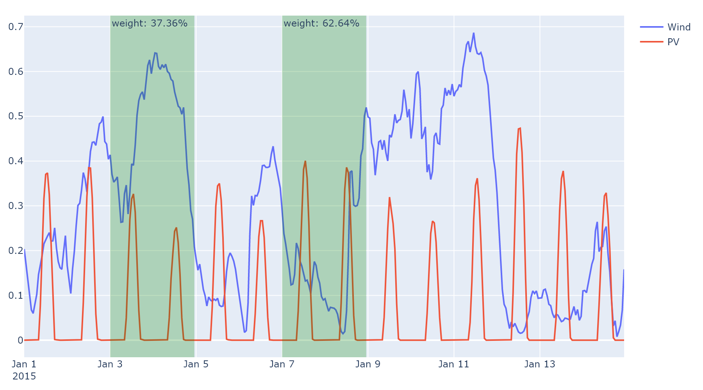

.. centered:: K-medoids

.. code-block:: python

    # Using K-medoids method
    temporal_data.calculate_RP(method = "kmedoids", N_RP=N_RP, RP_length=RP_length)
    # Show RP selected (highlighted in green) and their weights
    temporal_data.plot_RP()

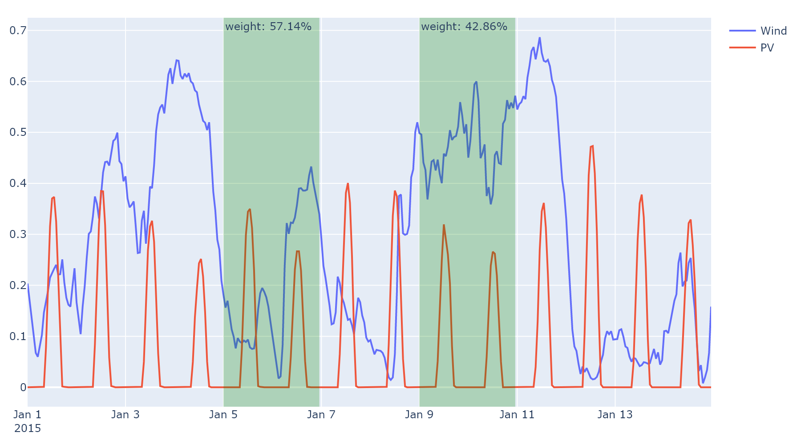

.. centered:: Random

For comparison purpose, the random method randomly select RP and their weights.

.. code-block:: python

    # Using random method to find RP and their weights three times
    temporal_data.calculate_RP(method = "random", N_RP=N_RP, RP_length=RP_length)
    temporal_data.plot_RP()

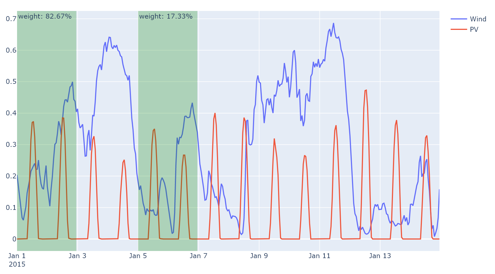

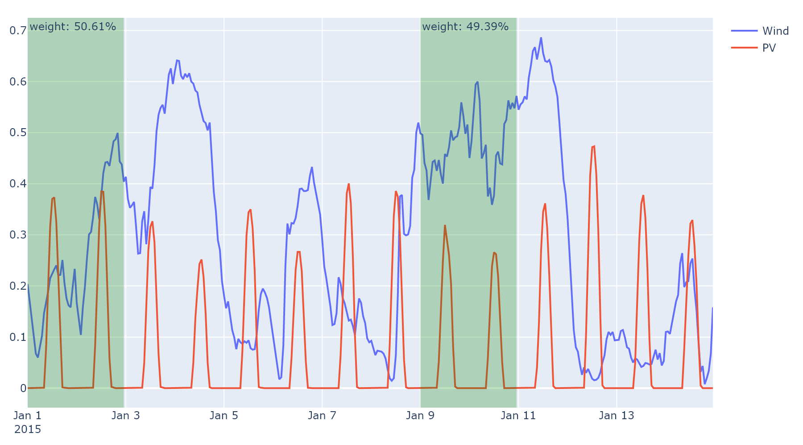

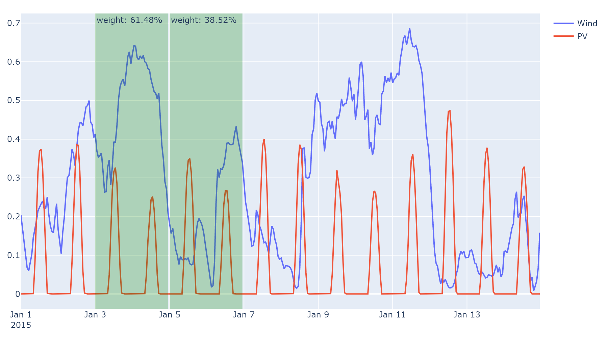

Duration Curves
---------------

To evaluate RP and their weights it is possible to compare the duration curve approximation from RP and original data's duration curve using ``plot_DC()``.

.. code-block:: python

    temporal_data.calculate_RP(method = "poncelet", N_RP=N_RP, RP_length=RP_length, N_bins=15)
    temporal_data.plot_DC()
    temporal_data.calculate_RP(method = "kmedoids", N_RP=N_RP, RP_length=RP_length)
    temporal_data.plot_DC()
    temporal_data.calculate_RP(method = "random", N_RP=N_RP, RP_length=RP_length)
    temporal_data.plot_DC()
    temporal_data.calculate_RP(method = "random", N_RP=N_RP, RP_length=RP_length)
    temporal_data.plot_DC()
    temporal_data.calculate_RP(method = "random", N_RP=N_RP, RP_length=RP_length)
    temporal_data.plot_DC()

.. centered:: Poncelet

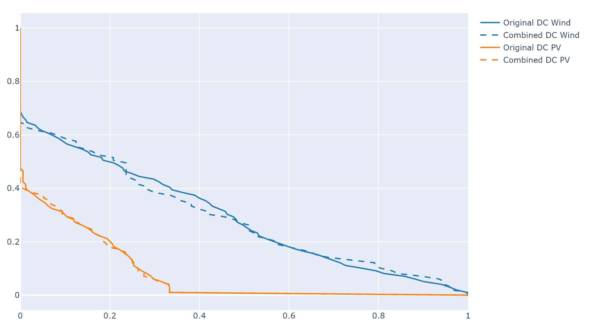

.. centered:: K-medoids

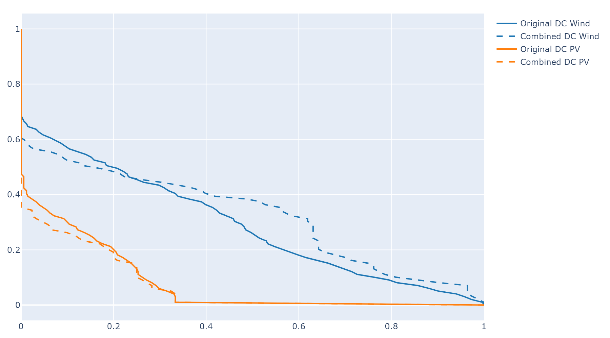

.. centered:: Random

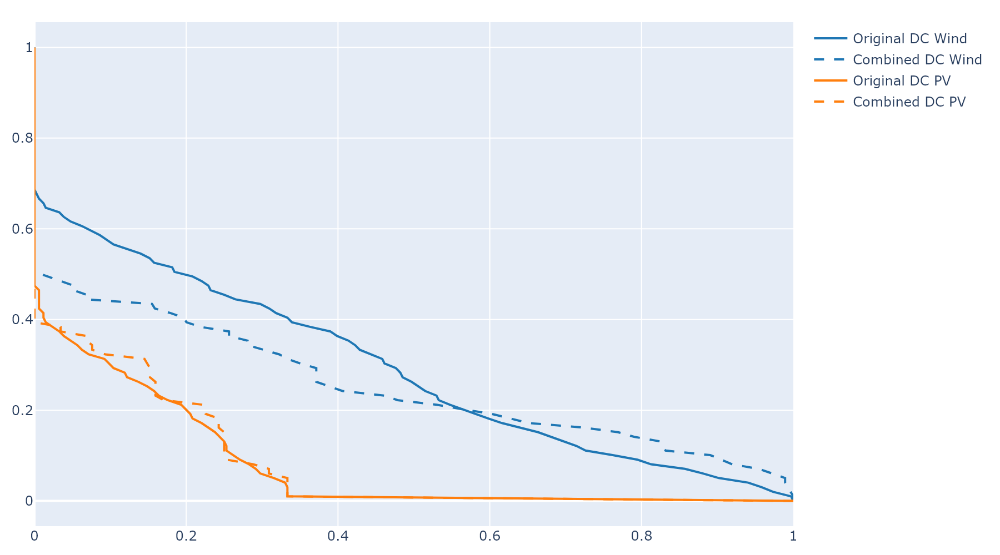

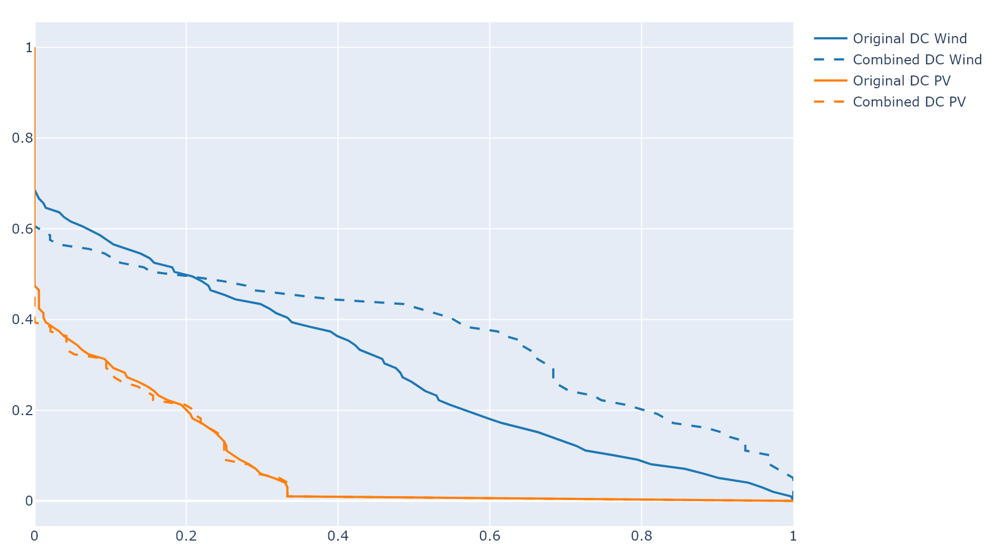

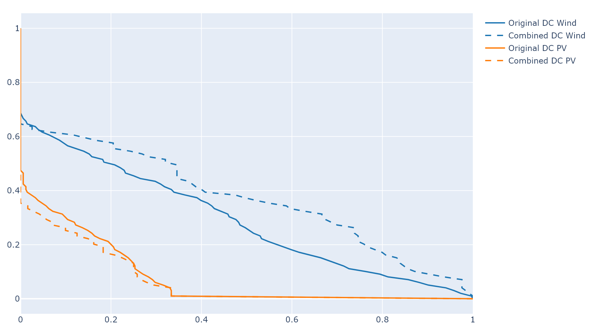

Export
------

Export RP and their weights using ``export()``.

.. code-block:: python

    temporal_data.export("Folder_receiving_export")
